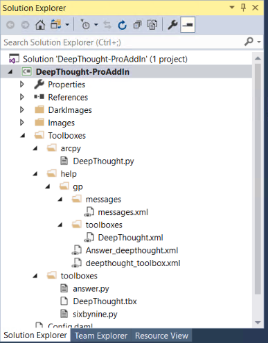
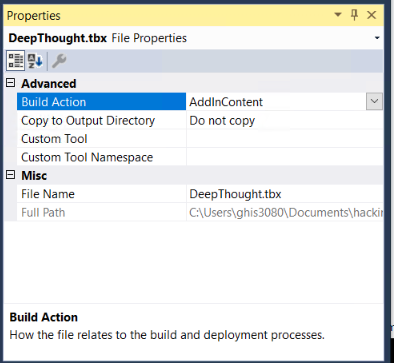

# deep-thought-add-in
Example of embedding and deploying gp toolbox through a .NET add-in.

Official sdk doc is at : https://github.com/Esri/arcgis-pro-sdk/wiki/ProGuide-content-and-image-resources#embedding-toolboxes

### why
This extension point is familiar to .net add-in developers, and allows them to 
1. include toolbox in their Add-ins (along with other add-in functionality)
1. toolbox are included as system toolboxes
   1. automatically get listed in the **Toolboxes** window
1. can pre-generate resource (optional)
   1. xml for all gp toolbox & tool strings & messages, also allows for translation
   1. include pre-generated python wrapper

### compiling and using deep-thought-add-in

1. build the add in follow ["Build your fist add in" instructions](https://github.com/Esri/arcgis-pro-sdk/wiki/ProGuide-Build-Your-First-Add-in)
1. open ArcGIS Pro
1. show the **Geoprocessing Tools** view
1. expand the **Deep Thoughts (alias from xml)**
1. run the **Answer (from xml)** tool

# instructions on how to create your own
Below is the process that was used to create this add-in.

### create a toolbox 
Create and implement your toolbox/tools normally.

### externalize resources (optional)
run `arcpy.gp.createtoolboxsupportfiles(<path to .tbx or .pyt>)` to produce resources (optional)*

This step is optional, running the command above generates external xml files for all tool/toolbox resources which allows them to be managed external to the toolbox file. And if translated xml are present and put in the correct location will automatically be picked up by gp framework when the ArcGISPro app is run on language other than default.

Additionally the command above will produce an python module with functions for each gp tool in the toolbox.  This module will be added to arcpy automatically using the toolbox.alias as a namespace (eg arcpy.deepthought.Answer)
.

For more details see:
 - [extending-geoprocessing-through-python-modules](https://pro.arcgis.com/en/pro-app/arcpy/geoprocessing_and_python/extending-geoprocessing-through-python-modules.htm) , ignore the instructions on deploying into python's site-package, instead deploy the files within the add-in as shown below
 - [geoprocessing_and_python/international-language-support](https://pro.arcgis.com/en/pro-app/arcpy/geoprocessing_and_python/international-language-support.htm)

gotcha: during development of the toolbox/tool it is not possible to use messages.xml as messages xml are only loaded into the global messages list at application startup, and during add-in development your messages.xml will not be found  in the default help/gp/messages or in the path relative to toolbox using add-in or site-packages extension point. May want to move strings into messages.xml during the final phase of development to make this easier.

### add toolbox to an add-in
1. install arcgis-pro-sdk, link: [ProGuide-Installation-and-Upgrade](https://github.com/Esri/arcgis-pro-sdk/wiki/ProGuide-Installation-and-Upgrade)
2. create an add-in, link: [see Pro Guide Build your first Add-in](https://github.com/Esri/arcgis-pro-sdk/wiki/ProGuide-Build-Your-First-Add-in)
3. add a folder to your Add-in called **Toolboxes** at top of directory structure
4. add all files (**Add Existing Item...**) and folders from *create a toolbox* section above, to the following structure

5. for each file in the Toolboxes folder, set their *Build Action* as *AddInContent*

